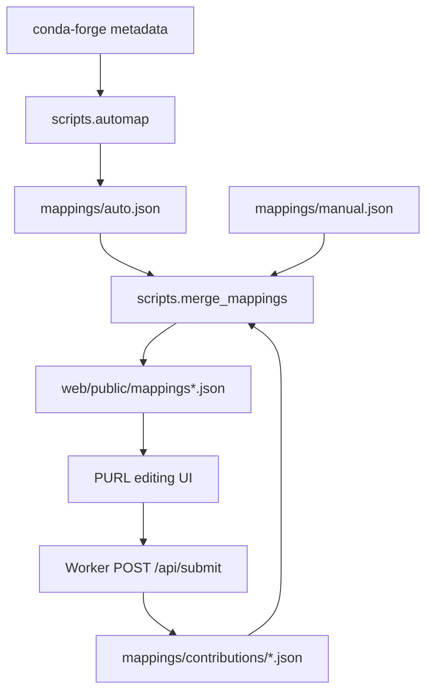
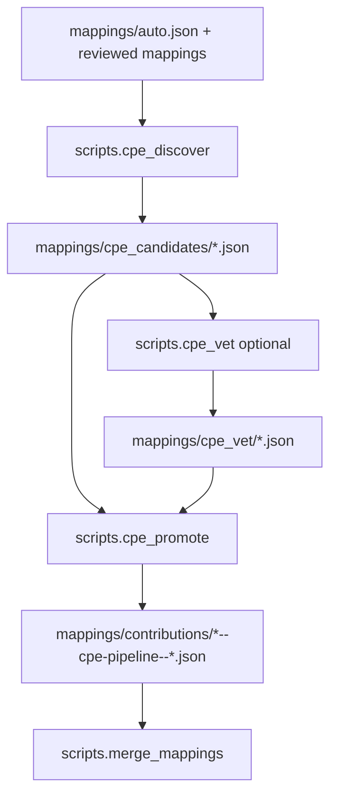

# PURL Associator

This repository maintains canonical **conda-forge package identity mappings**.
Each mapping record is keyed by conda-forge package name and carries identifiers
that downstream security tooling can use:

- a primary Package URL (**PURL**) and optional alternative PURLs
- optional CPE 2.3 vendor/product prefixes for NVD matching
- package context such as latest observed version, recipe/source URLs, summary,
  and download counts

CVE assignment, OpenVEX review state, AI CVE drafts, and SBOM-derived findings
are intentionally out of scope. A downstream CVE project should consume the
identity mapping payload produced here, enumerate conda-forge versions there,
and join those versions with OSV/NVD affected-version data there.

## Data model

The core object is a conda-forge package identity record:

```json
{
  "name": "ncurses",
  "version": "6.5",
  "purl": "pkg:github/ThomasDickey/ncurses-snapshots",
  "type": "github",
  "namespace": "ThomasDickey",
  "pkg_name": "ncurses-snapshots",
  "alternative_purls": [],
  "cpes": [
    "cpe:2.3:a:gnu:ncurses",
    "cpe:2.3:a:invisible-island:ncurses"
  ],
  "status": "verified"
}
```

PURLs identify source/package ecosystem coordinates. CPEs identify NVD
vendor/product coordinates. CPE strings stored here are identity-level prefixes;
this repository does not store CVE affected ranges or per-CVE version decisions.

## Sources and outputs

| Path | Purpose |
|---|---|
| `mappings/auto.json` | automatically inferred PURL mappings |
| `mappings/manual.json` | legacy/manual reviewed overrides |
| `mappings/contributions/*.json` | PR-submitted mapping contributions, including CPE pipeline output |
| `mappings/cpe_candidates/*.json` | audit output from CPE discovery |
| `mappings/cpe_vet/*.json` | optional AI tiebreaker output for ambiguous CPE candidates |
| `web/public/mappings.json` | generated full mapping bundle |
| `web/public/mappings-index.json` | generated compact index for the web app |
| `web/public/mapping_packages/*.json` | generated sharded package detail payloads |

## PURL flow



Useful commands:

```sh
pixi run purl:automap --only numpy,ripgrep,pandas
pixi run -e lite mappings:merge
pixi run -e lite mappings:validate
pixi run purl:test
```

## CPE flow

CPE discovery is part of identity mapping, not CVE assignment. The retained CPE
pipeline proposes NVD vendor/product prefixes and promotes accepted mappings as
normal contribution files. Those CPEs then flow through `scripts.merge_mappings`
into the public mapping payload.



Useful commands:

```sh
pixi run cpe:discover --top 50
pixi run cpe:vet --dry-run
pixi run cpe:promote --dry-run
pixi run -e lite mappings:merge
pixi run -e lite mappings:validate
```

## Frontend behavior

The GitHub Pages app is a PURL editing UI:

- users can review, edit, approve, or mark PURL mappings as unmapped
- staged PURL edits are saved locally until submitted
- submitted edits open PRs containing one new file under `mappings/contributions/`
- CPEs are displayed read-only as package identity metadata
- no CVE dashboard, OpenVEX review, AI CVE queue, or deep-inspection routes are
  served from this repository

The Worker exposes only:

- `POST /exchange` for GitHub OAuth code exchange
- `POST /api/submit` for PURL mapping contribution PRs

## Downstream CVE consumption

A downstream CVE project should consume `web/public/mappings.json` or the split
`mappings-index.json` + `mapping_packages/*.json` payload. It should then:

1. enumerate conda-forge package versions independently,
2. use PURLs for OSV/package-ecosystem matching,
3. use CPE prefixes for NVD matching,
4. apply OSV/NVD affected-version logic in that downstream project, and
5. store CVE assignment/review state outside this repository.

## Local SBOM demo

This fork also includes a small local CycloneDX generator that demonstrates the
first downstream step: enrich one concrete conda-forge artifact with its mapped
upstream PURL. The generated files are written under `local-advisory-channel/`
and are ignored by git.

```sh
pixi run -e lite sbom:generate pandas
```

By default the command reads the split mapping payload, uses the mapped
`version`/`build`/`subdir` as artifact coordinates, fetches conda-forge
`repodata.json` for that subdir, and writes:

```text
local-advisory-channel/<subdir>/sboms/<filename>/sbom-v1-<hash>.cdx.json
```

The `v1-<hash>` version is content-addressed from SBOM-significant inputs: the
conda artifact metadata, the mapping fields emitted into the SBOM, and the SBOM
generator input schema. Volatile values such as generation time do not affect
the version. Running the same generation twice for unchanged significant inputs
returns the same path and does not rewrite the SBOM or duplicate its event file.
When the mapped PURL or another SBOM-visible field changes, a new versioned SBOM
is appended next to the old one.

For offline or reproducible runs, pass a local repodata file:

```sh
pixi run -e lite sbom:generate pandas --repodata /path/to/repodata.json
```

You can also generate from a single package mapping entry JSON object:

```sh
pixi run -e lite sbom:generate --mapping-entry /path/to/package-entry.json
```

To generate SBOMs from a purl-associator payload, pass an auto/detail/index
mapping JSON to the batch wrapper:

```sh
pixi run -e lite sbom:generate-many mappings/auto.json
```

The batch command defaults to mapped PyPI packages. Use `--purl-type any` to
include other mapped PURL types, `--limit N` for a small prefix of eligible
entries, or `--random` to generate one random eligible package:

```sh
pixi run -e lite sbom:generate-many mappings/auto.json --random
```

For periodic local maintenance, use the cached refresh command:

```sh
pixi run -e lite sbom:refresh
```

That command reads `mappings/auto.json`, fetches conda-forge repodata once per
needed subdir, caches it under `.cache/repodata/`, generates SBOM candidates,
and appends only SBOM versions whose significant content hash is new. Re-running
the command with unchanged mapping and repodata content reports existing SBOM
versions instead of writing duplicates. Repodata fetches use conditional cache
headers when available and retry transient `429`/`5xx` responses with backoff.

The SBOM subject is the conda artifact (`metadata.component`). The mapped PyPI
PURL is emitted as a CycloneDX component with the artifact version added, so a
later OSV correlator can read component PURLs directly.

You can then query OSV for the component PURLs in that SBOM:

```sh
pixi run -e lite osv:correlate \
  local-advisory-channel/<subdir>/sboms/<filename>/sbom-v1-<hash>.cdx.json
```

The correlator calls OSV's `/v1/querybatch` endpoint with versioned component
PURLs and writes:

```text
local-advisory-channel/<subdir>/advisories/<filename>/
  osv-v1-<sbom-hash>-<osv-hash>.json
```

That sidecar contains the SBOM subject, the queried components, skipped
unversioned PURLs, and flattened vulnerability findings for a future advisory
channel index.

For periodic OSV maintenance, refresh all locally available SBOMs in one
deduplicated pass:

```sh
pixi run -e lite osv:refresh
```

By default the OSV refresh command scans `local-advisory-channel/*/sboms/`.
When local SBOM artifacts are cleaned after upload, pass
`--s3-sbom-source-uri s3://<bucket>/<prefix>` so the command lists SBOMs from
the S3 advisory channel, downloads them into a temporary channel-shaped staging
directory, deduplicates all versioned component PURLs, queries OSV in bounded
`/v1/querybatch` chunks, and writes a new advisory artifact only when the
normalized OSV result content is new. The advisory hash ignores volatile
generation time, so rerunning against the same OSV response does not write a
duplicate artifact. This OSV refresh should still run periodically even when no
new SBOM is generated, because OSV vulnerability data can change independently
from the package identity mapping. OSV requests also retry transient `429`/`5xx`
responses with backoff.

Useful maintenance variants:

```sh
pixi run -e lite sbom:refresh --limit 100
pixi run -e lite sbom:refresh --refresh-cache
pixi run -e lite osv:refresh --batch-size 250
pixi run -e lite osv:refresh --dry-run
```

For large local runs, use bounded workers to overlap local artifact generation
and S3 uploads:

```sh
pixi run -e lite sbom:refresh --workers 8 --s3-workers 4
pixi run -e lite osv:refresh --workers 8 --s3-workers 4
```

`--workers` controls package/SBOM or advisory generation workers. For SBOM
refresh it also overlaps per-package upload handling. For OSV refresh it
parallelizes local SBOM loading and advisory artifact generation after the
deduplicated OSV query completes. `--s3-workers` controls parallel S3 object
checks/uploads inside each upload batch. Keep both values modest for laptop
runs; S3 and OSV retries still apply independently.

To publish the local advisory channel to S3, pass an S3 destination. The scripts
use the AWS CLI, so AWS credentials must already be configured through the
environment, default profile, or `--s3-profile`.

```sh
pixi run -e lite sbom:refresh \
  --s3-uri s3://<bucket>/<prefix> \
  --progress-file .tmp/sbom-refresh-progress.json \
  --update-index \
  --cleanup-uploaded \
  --workers 8 \
  --s3-workers 4

pixi run -e lite osv:refresh \
  --s3-sbom-source-uri s3://<bucket>/<prefix> \
  --s3-uri s3://<bucket>/<prefix> \
  --progress-file .tmp/osv-refresh-progress.json \
  --update-index \
  --cleanup-uploaded \
  --workers 8 \
  --s3-workers 4
```

For interrupted local SBOM population runs, you can first snapshot the SBOM
objects already present in S3 and then skip S3 `HEAD`/`PUT` checks for those
artifacts on the next refresh:

```sh
pixi run -e lite sbom:s3-inventory \
  --s3-uri s3://<bucket>/<prefix> \
  --s3-profile <profile> \
  --s3-region <region> \
  --out .tmp/s3-sbom-inventory.json

pixi run -e lite sbom:refresh \
  --s3-uri s3://<bucket>/<prefix> \
  --s3-profile <profile> \
  --s3-region <region> \
  --s3-sbom-inventory .tmp/s3-sbom-inventory.json \
  --progress-file .tmp/sbom-refresh-progress.json \
  --update-index \
  --cleanup-uploaded
```

This is a resume-time optimization: the refresh still builds each candidate
SBOM locally so it can compute the content-addressed path and update indexes,
but when both the SBOM and event paths are listed in the inventory, it skips the
per-object S3 existence checks/uploads and removes the local temp files when
`--cleanup-uploaded` is set.

OSV advisory artifacts support the same S3 publication pattern. Because OSV
artifacts are derived from a specific SBOM version and current OSV response
content, one SBOM version can accumulate multiple advisory artifact versions
over time:

```text
local-advisory-channel/<subdir>/advisories/<filename>/
  osv-<sbom-version>-<osv-hash>.json
```

To avoid repeated S3 object checks for OSV artifacts already uploaded, snapshot
the existing advisory objects and pass that inventory to `osv:refresh`:

```sh
pixi run -e lite osv:s3-inventory \
  --s3-uri s3://<bucket>/<prefix> \
  --s3-profile <profile> \
  --s3-region <region> \
  --out .tmp/s3-osv-inventory.json

pixi run -e lite osv:refresh \
  --s3-sbom-source-uri s3://<bucket>/<prefix> \
  --s3-sbom-source-inventory .tmp/s3-sbom-inventory.json \
  --s3-uri s3://<bucket>/<prefix> \
  --s3-profile <profile> \
  --s3-region <region> \
  --s3-osv-inventory .tmp/s3-osv-inventory.json \
  --progress-file .tmp/osv-refresh-progress.json \
  --update-index \
  --cleanup-uploaded
```

The SBOM source inventory avoids listing S3 before downloading source SBOMs. The
OSV inventory is still only used after the exact advisory output path is known;
if OSV data has changed, the new hash produces a new path and the artifact is
uploaded. S3-sourced SBOMs are staged under `.tmp/osv-sbom-stage/` by default
and removed after a successful run unless `--keep-s3-sbom-stage` is set.

S3 keys preserve the local channel-relative path. For example:

```text
local-advisory-channel/noarch/sboms/demo/sbom-v1-abc.cdx.json
```

is published as:

```text
s3://<bucket>/<prefix>/noarch/sboms/demo/sbom-v1-abc.cdx.json
```

Before uploading, the publisher checks whether the target object already exists
and skips it if present. The object names are content-addressed, so repeated
runs do not intentionally overwrite artifacts. For stricter production
append-only guarantees, enforce write-once behavior with bucket policy,
versioning, or Object Lock.

When `--cleanup-uploaded` is enabled, local files are deleted only after the S3
upload succeeds or the object is confirmed to already exist in S3. Failed
uploads leave their local staging files in place for inspection or retry.

The optional `--progress-file` writes a temporary JSON status file describing
the current load type, inputs, totals, current item, counters, and final status.
It is intended for monitoring long local runs and can be deleted after the load
finishes.

All advisory-channel CLI commands also write logs to stderr and to a local file
under `.tmp/logs/` by default, for example
`.tmp/logs/sbom-refresh-<timestamp>-<pid>.log`. Use `--log-file <path>` to pick
a stable path for a run, or `--log-level DEBUG` when investigating retries,
cache decisions, S3 object checks, index updates, or OSV batches.

The `--update-index` flag keeps mutable catalog files in the advisory channel:

```text
local-advisory-channel/channel-index.json
local-advisory-channel/<subdir>/advisory-repodata.json
```

`channel-index.json` points at each subdir index. Each
`advisory-repodata.json` is keyed by conda artifact filename and stores the
current SBOM path/version, component PURLs, current OSV advisory path/version,
finding IDs, vulnerability count, and a compact status such as
`no_known_vulnerabilities` or `vulnerabilities_found`. Full SBOM and OSV details
remain in their separate artifacts.

Indexes are mutable snapshots. They are uploaded to S3 with overwrite semantics,
while content-addressed SBOM and OSV artifacts remain append-only. To rebuild
indexes from local artifacts at any point, run:

```sh
pixi run -e lite advisory:index
```

## Verification

Run these checks before opening a PR:

```sh
pixi run -e lite mappings:merge
pixi run -e lite mappings:validate
pixi run -e lite sbom:test
pixi run app:check
```

For frontend/Worker-only checks:

```sh
cd web && npm run build
cd worker && npm run typecheck
```
